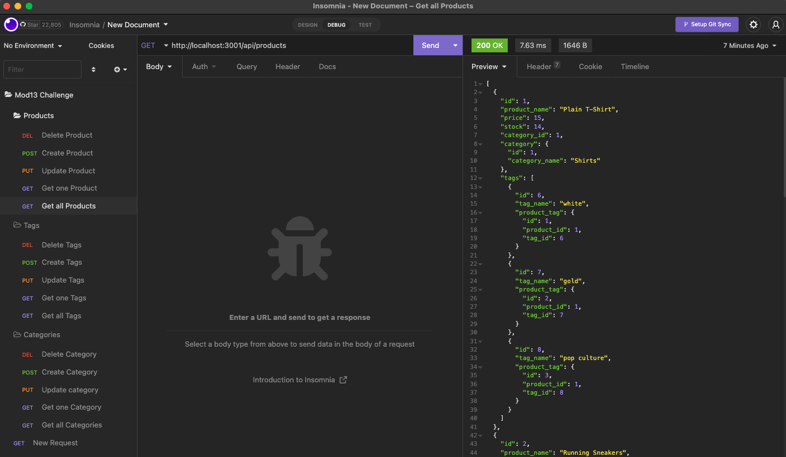

# E-commerce Back End Starter Code

mod 13 challenge (Sequelize, MYSQL, Inquirer)

## Description

This is an e-commerce back-end foundation with seeded data to showcase API get routes for categories, products, and tags. This includes API GET, POST, PUT, and Delete routes that have been tested using Insomnia. View live demo here https://drive.google.com/file/d/1tXFiaW9vJeVRiOPuv2vrOi9Nca7hfqMx/view .

Functional description via user story below:

GIVEN a functional Express.js API

WHEN I add my database name, MySQL username, and MySQL password to an environment variable file

THEN I am able to connect to a database using Sequelize

WHEN I enter schema and seed commands

THEN a development database is created and is seeded with test data

WHEN I enter the command to invoke the application

THEN my server is started and the Sequelize models are synced to the MySQL database

WHEN I open API GET routes in Insomnia for categories, products, or tags

THEN the data for each of these routes is displayed in a formatted JSON

WHEN I test API POST, PUT, and DELETE routes in Insomnia

THEN I am able to successfully create, update, and delete data in my database

## Table of Contents

- [Installation](#installation)
- [Usage](#usage)
- [Issues](#issues)
- [License](#license)
- [Contributing](#contributing)
- [Questions](#questions)
- [Images](#images)

## Installation

You can install this by downloading the code from my GitHub repository. See the link below in the [Questions](#questions) section.

## Usage

Expected use is described:

AS A manager at an internet retail company

I WANT a back end for my e-commerce website that uses the latest technologies

SO THAT my company can compete with other e-commerce companies

## Issues

N/A

## License

This project is not currently licensed.

## Contributing

You can contribute to this project by either:

- contacting me and collaborating with your ideas on how to make it better! OR
- downloading the code, updating with your own ideas, and then sending me a pull request for review!

## Questions

See more details at https://www.github.com/cduwors or contact cduwors@mail.com.

GitHub Repository: https://github.com/cduwors/retail-backend-mod13

## Images

Insomnia Testing Sample Image

